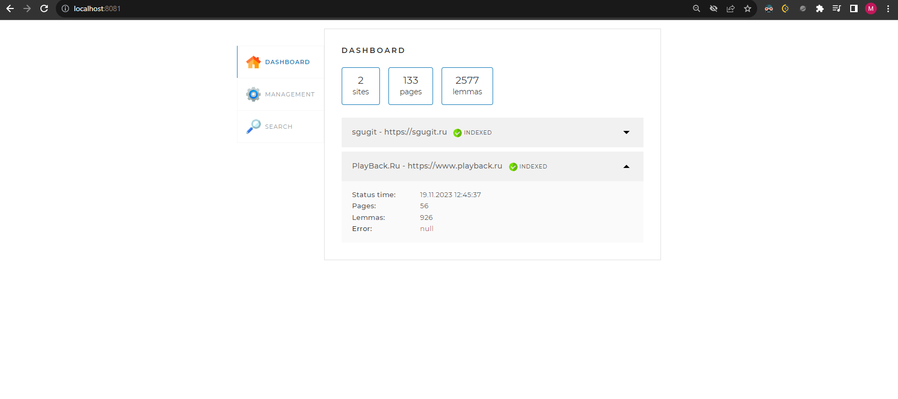

# Локальный Поисковый Движок

## Веддение
Проект представляет собой локальный поисковый движок для информационно-новостного портала, позволяющий посетителям сайта быстро находить информацию.
## Цели проекта 
- Реализация собственного поискового движка, способного обрабатывать запросы пользователей и предоставлять релевантные результаты.
- Создание Spring-приложения, работающего с локальной базой данных MySQL, с простым веб-интерфейсом и API.
## Стек Технологий
- Java (версия)
- Spring Boot 
- Maven 
- MySQL 
- JSOUP (для парсинга веб-страниц)
- Apache Lucene Morphology (для лемматизации)
## Принципы работы Поискового Движка

- Задание адресов сайтов в конфигурационном файле.
- Автоматический обход страниц сайтов и их индексация.
- Обработка пользовательских запросов через API.
- Трансформация запросов в базовые формы слов и поиск страниц.

## Этапы Реализации

1. **Подготовка:** Настройка проекта, создание и подключение к базе данных.
2. **Система Обхода Веб-Страниц:** Реализация многопоточного приложения для обхода сайтов и сохранение содержимого в БД.
3. **Система Индексации Веб-Страниц:** Подключение лемматизатора и формирование поискового индекса.
4. **Функциональность Поиска:** Реализация логики поиска и предоставление результатов пользователю.

## Моя Роль в Разработке

- Проектирование и реализация логики обхода и индексации сайтов.
- Разработка API для взаимодействия с поисковым движком.
- Настройка и интеграция базы данных MySQL для хранения индексированной информации.
- Обеспечение многопоточной работы приложения и обработки исключений.

## Запуск Приложения

Запуск осуществляется через `localhost:8081` с предварительной настройкой `application.yaml`.

